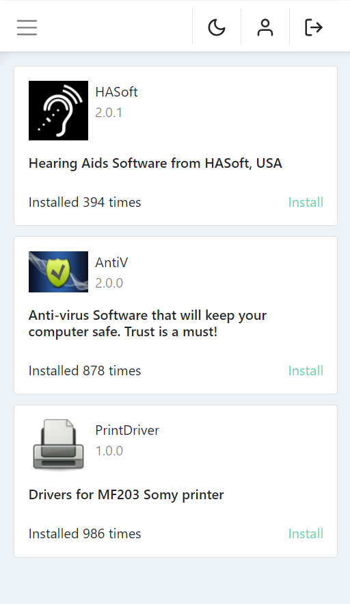
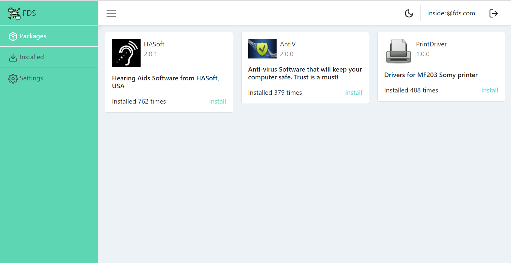
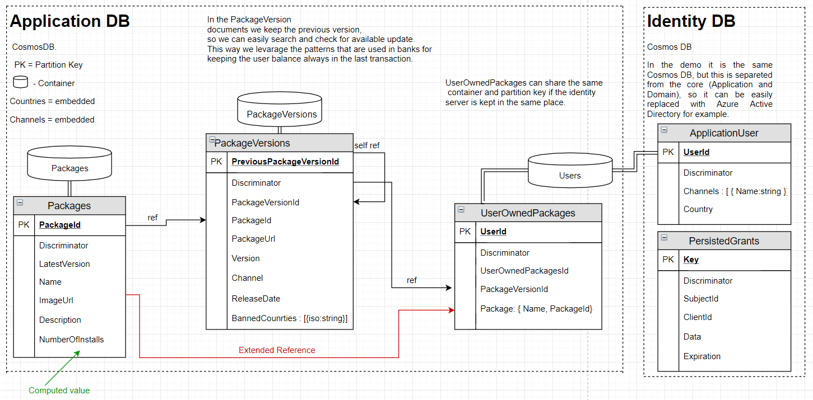

# ASP.NET Core with React Architecture

||

<br/>

## Technologies

* ASP.NET Core 3.1
* Azure Cosmos DB
* Entity Framework Core 3.1
* Identity Server 4
* MediatR
* FluentValidation
* AutoMapper
* NUnit
* NSwag
* React
* Typescript
* React Query
* Bootstrap
* React Testing Library
* Cypress


## Installation

To run demo locally, you will need to install and run Azure CosmosDB Emulator first: [download](https://docs.microsoft.com/en-us/azure/cosmos-db/local-emulator?tabs=cli%2Cssl-netstd21)

```bash
git clone https://github.com/pavloskii/dotnetcore-react-architecture.git
cd dotnetcore-react-architecture
dotnet run
```

## Screenshots

Mobile:


Desktop:



## Data Model




## Resources and Credits

* Robert C. Martin (Uncle Bob) - https://blog.cleancoder.com/uncle-bob/2012/08/13/the-clean-architecture.html
* Jason Taylor - https://jasontaylor.dev/clean-architecture-getting-started/
* Kevin C. Dodds - https://kentcdodds.com/blog/authentication-in-react-applications/
* Countries - https://gist.github.com/jplwood/4f77b55cfedf2820dce0dfcd3ee0c3ea
* Katerina Limpitsouni (unDraw ilustrations) - https://undraw.co/illustrations
* Country Finder by IP- https://ipinfo.io/
* Logo by Eucalyp - https://www.flaticon.com/authors/eucalyp / https://www.flaticon.com/
* Images from Pixabay - https://pixabay.com/
